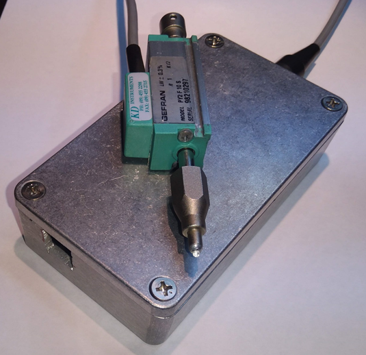
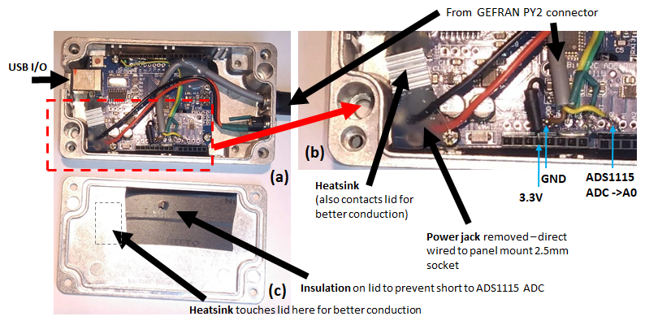
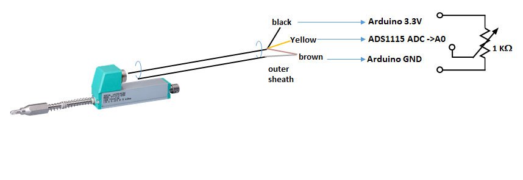
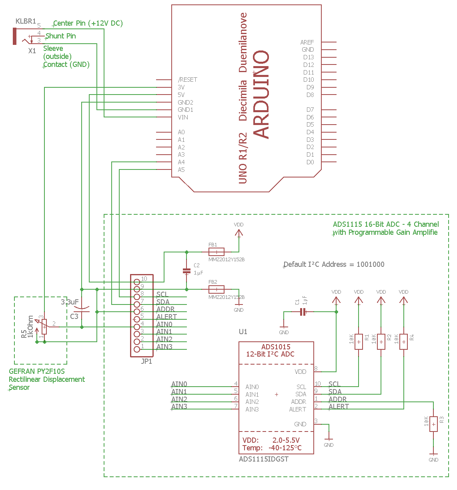

# Distance Sensor I/O (Rectilinear [1D] Displacement Sensor])
## Introduction

This project uses a [GEFRAN PY2F10S](https://www.gefran.com/en/in/products/73-py2-touch-version-with-ball-tip) that I had available and connects to an Arduino that provides serial I/O at 9600 baud and includes stage calibration.  Total travel range is ~10mm.  An initial attempt to interface directly to a PC powered Arduino using the internal 10-bit ADC resulted in extremely high noise having an RMS variation around 10 &#181;m.  This was due to 1) the noise in the PC 5V power rail, 2) the use of the same rail for the ADC reference voltage and 3) the limitations of a 10 bit ADC.  Subsequently, the current version uses:
1) an external power supply (currently 12V but anything >7V is fine)  - this ensures a stable 5V and 3.3V power supply
2) powering the GEFRAN PY2F10S distance sensor using the 3.3 V rail rather than the 5 V rail.  Since the sensor is basically a variable 1k&#937; potentiometer, this results in nominally 3.3mA through the sensors.  The recommended level is 0.1 mA but any value less than 10 mA is acceptable according to the data sheet.  Since the 3.3V rail is not loaded by any other components on the Arduino board (except maybe an LED) this ensures that the power supply od dedicated to run only this sensor and hence should supply a well regulated rail voltage.
3) migration to a 16-bit ADC using the [ADS1115 16 Bit Converter Module](https://www.adafruit.com/product/1085).
4) internal averaging on the measured distance data

## Physical Configuration

 
 <mycaption>**Figure 1.** Closed box showing USB input and GEFRAN PY2 distance sensor</mycaption>

The assembled box with the  GEFRAN PY2 distance sensor is shown in Figure 1.  the entire package is fairly small, with all components fitting within the 110&#215;60&#215;30 Aluminium Box  110x60x30 Aluminium [Box](https://www.jaycar.com.au/economy-die-cast-aluminum-boxes-111-x-60-x-30mm/p/HB5062) .  However  [ADS1115 16 Bit Converter Module](https://www.adafruit.com/product/1085). to push the USB connector close to the side panel of the box, it was necessary to remove the PCB power connector on the Arduino (See Figure 2b) 

  
 <mycaption>**Figure 2.** Opened Box showing (a) main board, (b) expanded view showing heatsink on 5V regulator, removed power jack, replaced with wiring to the panel mounted 2.5 mm jack, sensor wiring (see Figure 3) and connector to PY2 sensor on the 16Bit ADC</mycaption>  

The internals of the box as shown in Figure 2, with the exploded image shown in Figure 2b.  Two (2)-stacked heatsinks are used (glued together with [thermal paste](https://www.jaycar.com.au/adhesive-heatsink-compound-5g-tube/p/NM2014)) to help dissipate the heat from the 5V regulator and to ensure the heatsinks come into intimate contact with the top metal lid of the box to further enhance the heat sinking.  The Arduino PCB power connector is removed to allow the USB connector to be nearer to the edge panel, and 2 flying leads (red & black) are used to connect to a [2.5mm panel mount](https://www.jaycar.com.au/2-5mm-bulkhead-male-dc-power-connector/p/PS0524) connector to the 12V DC external supply.

The GEFRAN PY2F10 rectilinear Displacement sensor is shown in Figure 3 along with the corresponding color coded wiring.  Interestingly, GEFRAN call this a Rectilinear Displacement sensor, which is really just saying it measures  displacement in 1D.  Since displacement is a vector and distance a scalar, and the output of the sensor is a scalar quantity, I prefer to refer to this as a distance sensor for simplicity.  Others might argue over semantics.  The equivalent circuit is also shown in Figure 3, where the sensor acts as simply a continuous variable resistor.  Importantly, the start and end ranges are not valid and over about 1-1.5mm on each end, there is no valid output.  I have accounted for that in the firmware and reported out-of-range values in these ranges.

  
 <figcaption>Figure 3. GEFRAN PY2F10 rectilinear Displacement sensor with color coded wiring to the Arduino  power rails and the ADS1115S ADC<figcaption>

## Circuit Configuration
The Schematic for the setup is shown below - the EAGLECAD layout is in the repository as [GEFRAN_DistanceSensor.sch], created using [EAGLECAD](https://www.autodesk.com/products/eagle/overview).

 
 <figcaption>Figure 4. Schematic of the Arduino (Uno) interface to the GEFRAN PY2 distance sensor through the 16Bit ADC<figcaption>
  

The use of the ADS1115S is important for 2 reasons:
1) the ADS1115S contains an internal, high precision, temperature stabilized voltage reference.  This is essential when needing to take accurate measurements. Just as important is a stable voltage supply for the sensor (as discussed above) when I decided to use the 3.3V reference from the Arduino board.
2) the 16 bit resolution and high 820 samples-per-sec specifications of this ADC make it considerably better than using the 10-bit Arduino ADC, or even and oversampled Arduino ADC which has been shown to be capable of an [ equivalent of 16 bits but at a much slower samples per seconds](https://www.electricrcaircraftguy.com/2014/05/using-Arduino-unos-built-in-16-bit-adc.html) . The Arduino UNO fits within the small metal box (Figure 2) with a square cut out one side for the USB and a power and lead for the PY2F10S distance sensor.  

## Power Supply
Running from a  12V DC power supply (>200mA) results in significant heating of the on-board 5V regulator.  It is essential the regulator has an appropriate sized heat-sink.  When using a 12V supply, (12-5)=7V is dropped across the regulator.  If the board draws 50 mA (TBD) this suggests up to 0.35W is being dissipated in the regulator.  The Arduino uses a NCP117ST50T3G Low-Drop-Out (LDO) voltage regulator in an SOT−223 package.  The [NCP117ST50T3G datasheet] ( https://www.onsemi.com/pub/Collateral/NCP1117-D.PDF) indicates the Thermal Resistance, Junction−to−Ambient with NO HEATSINK is 160 &#176;C/W.  Hence 0.35 W power dissipation on this regulator corresponds to a 56 &#176;C rise in temperature above ambient or a nominal temperature of 81 &#176;C at room temperature (25 &#176;C).  While this is technically below the 125 &#176;C maximum operating temperature, I don’t like to approach temperatures where water can boil! During initial testing even a small 9&#215;9&#215;5mm heatsink reached extremely high temperatures and hence I decided to stack 2-small heat sinks together, with each glued in place with [heat sink adhesive](https://www.jaycar.com.au/adhesive-heatsink-compound-5g-tube/p/NM2014).  The heatsinks also make contact to the Aluminium metal lid which also helps to dissipate the heat and prevent the steady state temperature of the LDO regulator and heatsink from getting to large.  This ensures good 5V regulation and extends the life of the board.
## Firmware Configuration
The software was written under the Arduino IDE environment. The  code uses the [Adafruit ADS1X15 library]( https://github.com/adafruit/Adafruit_ADS1X15) as assigns the PY2 sensor to ADS1115-Port-A0.  The serial connection outputs data at 9600 baud.
 
The code [distanceSensor.ino](distanceSensor.ino) is a basic interface for testing and calibration.  It provides a fixed number of averages and simply zeros the sensor after reboot or after pressing the reset button.
## Testing
Initial testing indicated the following results

#Repeating zeroing.
The stage was bolted to the bench and the plunger stage lifted repeatedly.  The reported zero values were then summarised in the following statistics.

#Calibration.
A digital calliper was used as a reference measure and expected to be accurate to [20 &#181;m](https://www.jaycar.com.au/medias/sys_master/images/9318637535262/TD2082-manualMain.pdf) up to 10mm distance.  

